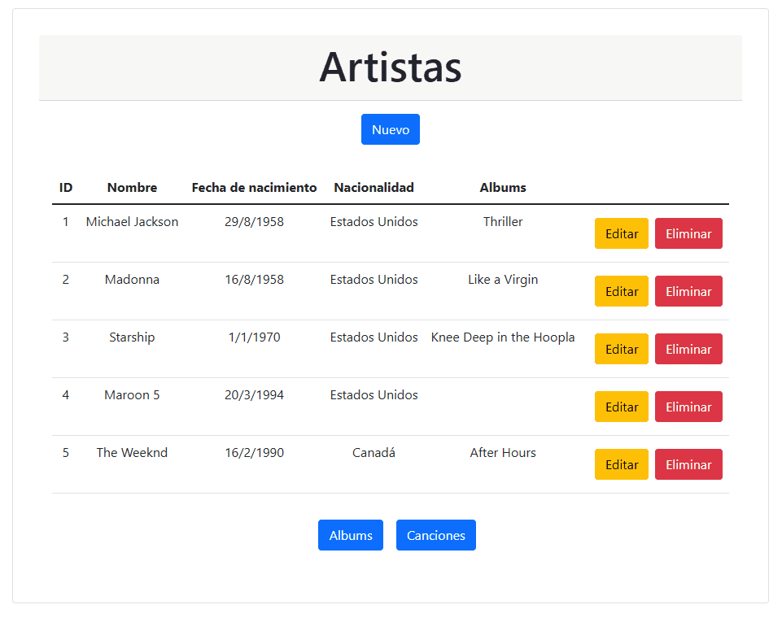

# CRUD Discografía - Frontend :cd:

## Descripción :page_facing_up:

Este proyecto consiste en una aplicación frontend desarrollada para gestionar una discografía. Funciona en conjunto con su [backend](https://github.com/fabri4c/crud-discografia-backend) y permite realizar operaciones CRUD (Crear, Leer, Actualizar y Eliminar) sobre registros de tres tablas: Artistas, Álbumes y Canciones.

### Tecnologías :gear:

- **React 18**: Librería para construir la interfaz de usuario.
- **React Router 6**: Herramienta para gestionar rutas en aplicaciones React.
- **Vite**: Entorno de desarrollo y compilador optimizado para aplicaciones modernas de JavaScript.
- **PNPM**: Administrador de paquetes ultra rápido y eficiente en espacio.
- **Axios**: Cliente HTTP basado en promesas para hacer peticiones.
1
## Instalación :wrench:

### Requisitos

- Node.js 16 o superior
- PNPM
- Editor de código fuente (por ejemplo, Visual Studio Code)

### Pasos

1. Clona el repositorio en tu máquina local.
2. Abre una terminal y navega a la carpeta del proyecto.
3. Ejecuta el comando `pnpm install` para instalar todas las dependencias.
4. Una vez instaladas las dependencias, ejecuta el comando `pnpm run dev` para iniciar el servidor de desarrollo.

## Uso :computer:

Una vez que hayas iniciado el servidor de desarrollo con `pnpm run dev`, abre tu navegador y visita [http://localhost:5137](http://localhost:5137) para ver la aplicación en ejecución.

## Contáctame :mailbox_with_mail:

| &nbsp;       | &nbsp;                                           |
| ------------ | ------------------------------------------------ |
| **GitHub**   | [@fabi4c](https://github.com/fabri4c)            |
| **LinkedIn** | [@fabri4c](https://www.linkedin.com/in/fabri4c/) |
| **Twitter**  | [@fabri_4c](https://twitter.com/fabri_4c)        |

## Pruebas :bar_chart:

Aún no se han implementado pruebas para este proyecto.

## Licencia :balance_scale:

Este proyecto está licenciado bajo la [Unilicencia](https://unlicense.org), lo que significa que puedes usarlo sin ninguna restricción.

## Contribuciones :handshake:

Se aceptan contribuciones a este proyecto. Por favor, contáctame para obtener más información.

## Agradecimientos :heart:

[ENUCOM](https://enucom.com.mx/)

